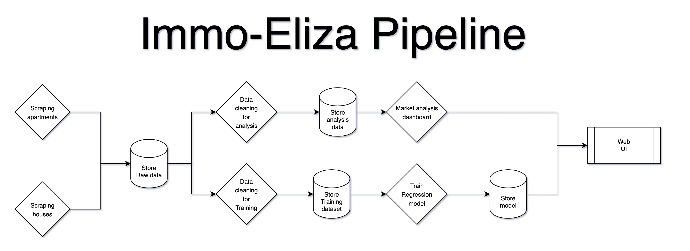

<h1 align="center">
🦀 HermitCrab Sea Breeze 🦀
</h1>


<p align="center">
    <br>
    <a></a>
    <br>
    <br>
    <a></a>
    <h2 align="center">Using:
    <br>
    <br>
    <a></a>
    <a></a>
    <a></a>
    <br>
</p>

## 📖 Description

To finish up HermitCrab's ImmoEliza project, we determined that it would be necessary to automate the process of Collecting, Processing and Analyzing the Data, as well as the creation of the Machine Learning Model from said Data.

To do so, we have made implemented and adapted our program to Apache Airflow, with the goal of creating a pipeline to automatically run the tasks every day.

## 📋 Pipeline Structure
The pipeline runs daily at 02:00 CE(S)T. The reasoning is to minimizing server load when obtaining new data and adding it to our database. The pipeline has the following structure:



- First it scrapes all the data from immoweb, and stores it in a .csv file
- It then cleans the data, for both Analysis and Training of a Machine Learning Model.
- The data is then used for Analysis, as well as the creation of a newer model.
- All daily data is saved and archived as different versions, so you can compare performance metrics, as well as changes to the Housing Market.

## 🛠️ Setup & Installation

- Create a new virtual environment by executing this command in your terminal:
  `python3 -m venv crab-api`
- Activate the environment by executing this command in your terminal:
  `source crab-api/bin/activate`
- Install the required dependencies by executing this command in your terminal:
  `pip install -r requirements.txt`

## 👩‍💻 Usage

This project uses Docker Containers to run Airflow, so make sure to have Docker Compose, and have run the commands above to install requirements.txt, and then run the following command in your terminal:

```
docker compose up --build
```
## 📦 Project Structure

```
.
├── assets/
│   └── immo-eliza-schema.png
├── config/
│   └── ...
├── dags/
│   ├── eliza/
│   │   ├── analysis/
│   │   │   └── ...
│   │   ├── collection/
│   │   │   └── ...
│   │   └── machinelearning/
│   │       └── ...
│   └── eliza.py
├── logs/
│   ├── dag_id=immo_eliza/
│   │   └── ...
│   ├── dag_processor_manager/
│   │   └── ...
│   └── scheduler/
|       └── ...
├── plugins/
├── .env
├── .gitattributes
├── .gitignore
├── docker-compose.yaml
├── Dockerfile
├── README.md
└── requirements.txt
```